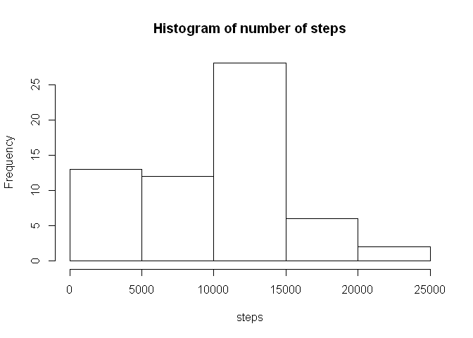
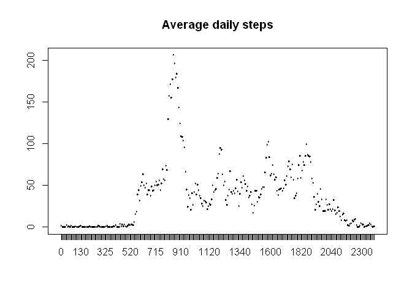
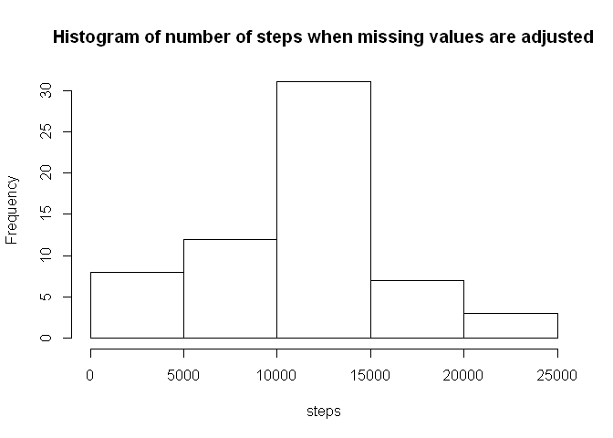
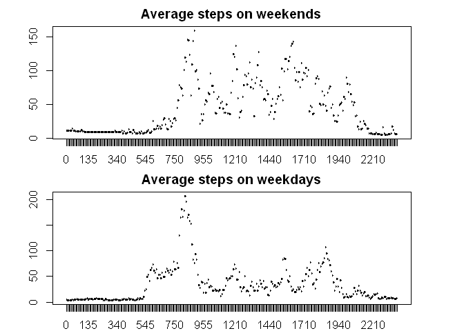

# Reproducible Research: Peer Assessment 1


## Loading and preprocessing the data

```r
library(data.table)
library(chron)
unzip("activity.zip")
d = fread("activity.csv")
d$interval = as.factor(d$interval)
d$date = as.Date(d$date)
```

## What is mean total number of steps taken per day?

```r
d.sum = d[,sum(steps,na.rm=T),by=date]
d.sum.mean = mean(d.sum[,V1],na.rm=T)
hist(d.sum[,V1],xlab="steps",main="Histogram of number of steps")
```

 

The mean and the median of the total number of steps taken per day is 9354.23 
and 10395, respectively. 


## What is the average daily activity pattern?

```r
d.mean = d[,mean(steps,na.rm=T),by=interval]
plot(d.mean$interval,d.mean$V1,type="l",main="Average daily steps")
```

 

The interval that on average across all the days in the dataset contains the maximum 
number of step is 835

## Imputing missing values
The number of missing values is 2304.

```r
d.new = d
d.new[is.na(d$steps),]$steps = as.integer(round(merge(d[is.na(d$steps),],d.mean,by="interval")$V1,0))
d.sum.new = d.new[,sum(steps,na.rm=T),by=date]
d.sum.mean.new = mean(d.sum.new[,V1],na.rm=T)
hist(d.sum.new[,V1],xlab="steps",main="Histogram of number of steps when missing values are adjusted")
```

 

After replacing missing values with the average daily activity pattern the mean and the median of the total number of steps taken per day is 10765.64 
and 11015, respectively. The increase of the mean and the median because of this adjustment is 1411.41 and 620, respectively.

## Are there differences in activity patterns between weekdays and weekends?

```r
invisible(d.new[is.weekend(d.new$date),weekday:="weekend"])
invisible(d.new[!is.weekend(d.new$date),weekday:="weekday"])
d.new$weekday = as.factor(d.new$weekday)
d.mean.weekend = d.new[d.new$weekday=="weekend",mean(steps),by=interval]
d.mean.weekday = d.new[d.new$weekday=="weekday",mean(steps),by=interval]
par(mfrow=c(2,1),mar=c(2,4,2,4))
plot(d.mean.weekend$interval,d.mean.weekend$V1,type="l",main="Average steps on weekends")
plot(d.mean.weekday$interval,d.mean.weekday$V1,type="l",main="Average steps on weekdays" )
```

 
